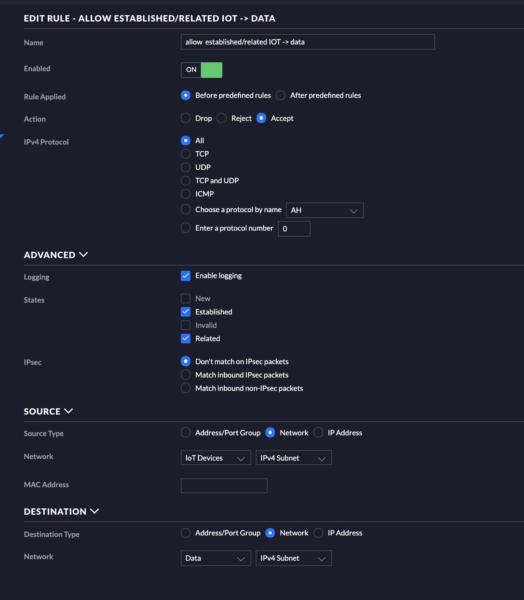

+++
categories = ["Tutorial"]
date = "2019-04-01T13:24:00-05:00"
description = "Cross VLAN traffic with a USG and Apple Airplay"
draft = false
image = "wall.jpg"
tags = ["apple", "usg", "firewall", "unifi", "ubiquiti", "airplay"]
title = "Cross VLAN traffic with a USG and Apple Airplay"
slug = "/apple-airplay-usg"
+++

# Background
As a follow on from a [previous post](/sonos-usg-firewall-ports) I discussed how I locked down VLAN's from a IoT VLAN to my core data VLAN.  In that post I described how I got my Sonos speakers and Sonos controller to work over locked down VLAN's.  I recently hooked up an old Apple Airport Express and music wouldn't flow when I was on the data VLAN to the IoT VLAN where the Airport Express resided.

# Instructions
If you followed my [previous blog post](/sonos-usg-firewall-ports) it talked about how to lock down communications from the IoT VLAN to the data VLAN and allow pinholes through for Sonos.  To get things working for Apple Airplay it was actually pretty easy.  First you need to make sure you have mDNS turned on.  To check this do the following.

1. Goto settings in your controller
2. Goto the services tab on the left
3. Click MDNS at the top
4. Make sure the toggle is set to `On`
5. Click apply changes 

The next step is creating a single firewall rule.  The rule that needs to be created is an allow rule that allows established/related traffic from your IoT VLAN (the VLAN that your Apple Airplay device is on) to the data VLAN (secure VLAN).  See below for a screenshot.

This firewall rule should be created in the LAN_IN category.

**Note:**  As with other allow rules this rule MUST go before your deny rules.

# Credit
https://en.community.sonos.com/troubleshooting-228999/multiple-subnets-vlans-and-sonos-workable-clavister-solution-30950

https://community.ubnt.com/t5/UniFi-Routing-Switching/Airplay-across-VLAN-How-to-do/m-p/1966141/highlight/false#M48087

