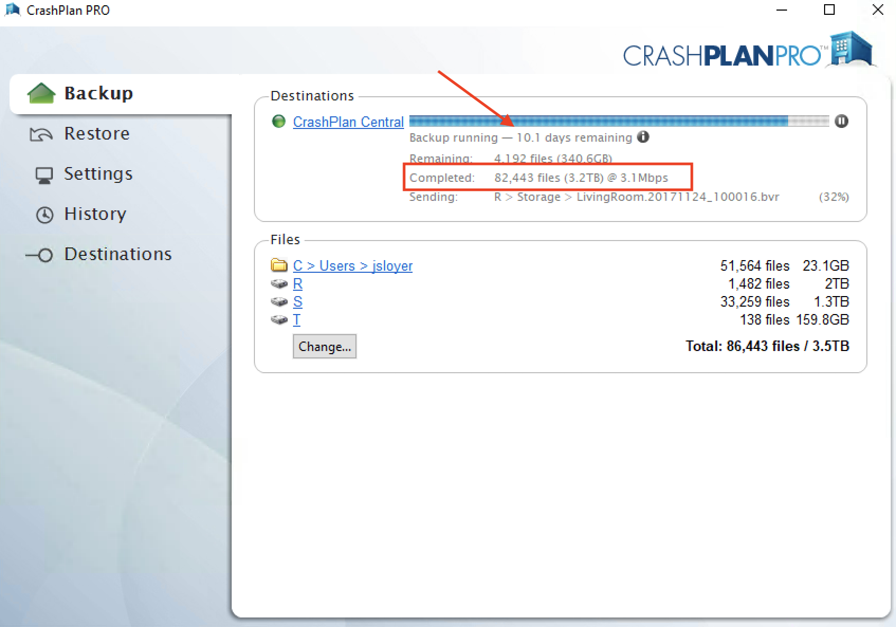
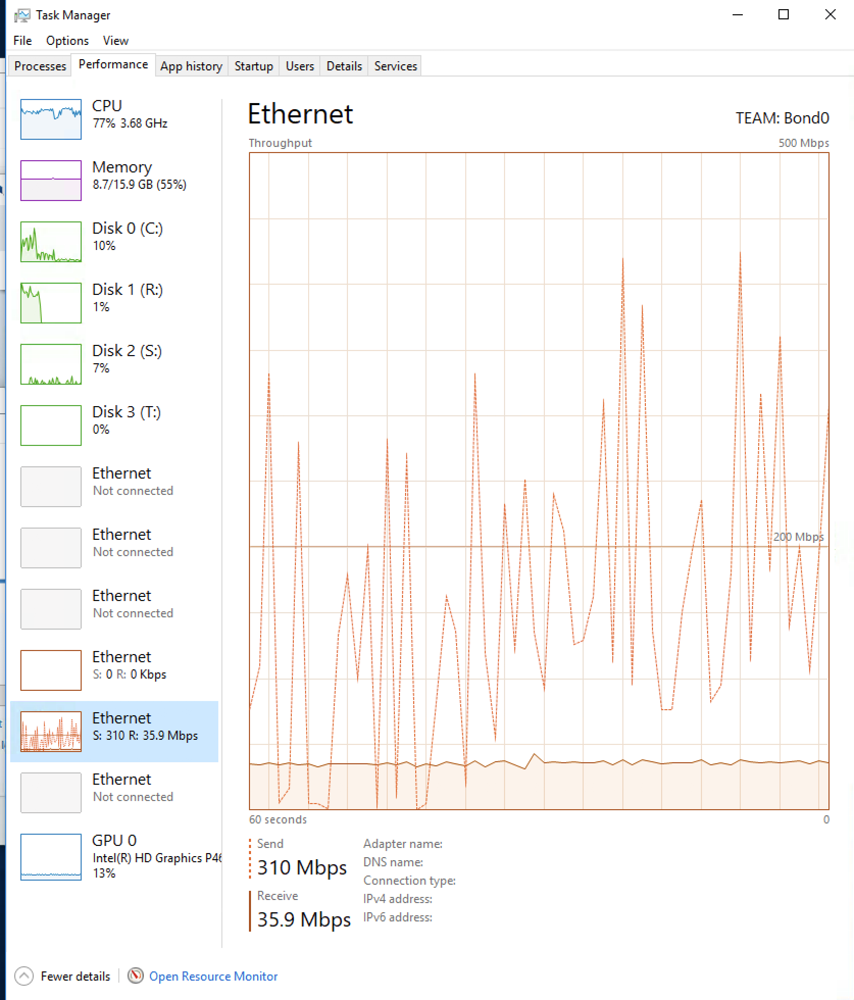
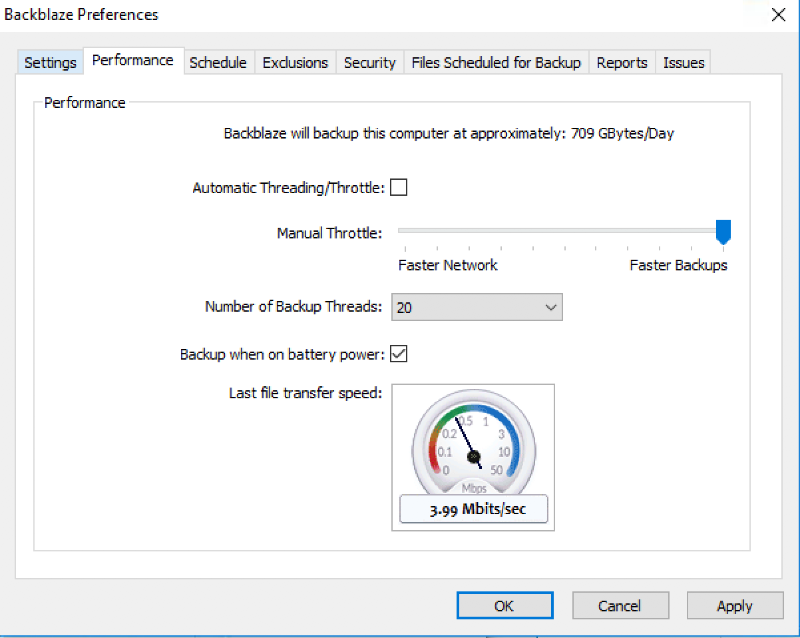

+++
categories = ["Backup"]
date = "2017-12-06T14:11:14-05:00"
description = ""
draft = false
image = "alpine.jpg"
tags = ["backup"]
title = "Backblaze vs Crashplan"
slug = "backblaze-vs-crashplan/"
+++

Most people do not think about backups or want to take the time to set one up or spend the money.
Boy is that a mistake... Most people (myself included) are in that boat and they realize they need to backup
their data after its too late and they have lost that precious photo of their baby being born.

There are multiple methods for backing up your data, they range from a thumb drive to remote backup.  The various
mediums range in price from free all the way up to several hundred dollars a year.  For me you can't put a price
on your precious home videos and photos...  The different backup medium's also range in complexity in terms of ease of use and setup.

## My backup strategy
For about the last year I have been backing up all of my computers to Crashplan.  I was in love with how simple it was use and when the
day came that I needed to restore something I could go in their application, search for the file, and restore it.  I could even restore
deleted files that were deleted months ago.  About 4 months ago I started backing up my Macbook Pro with Time Machine.
Crashplan was too slow with upload speeds so I decided that if I needed something quickly restored I have it locally.

This worked out great until I moved recently... At my old residence I had Time Warner Cable Internet (now Spectrum), my connection
speed was 300Mbps down and 20Mbps up.  Crashplan was usually close to consuming the full speed of the link with other things sharing
my upload speed.  However, when I moved to my new residence I got AT&T Fiber which offers a full 1Gbps down and 1Gbps up speed.   I have security cameras (nanny cam's) at my place and they record motion to a local Windows server I have.  At my old place I was only running
2 cameras so Crashplan was able to keep up.  However, at the new place I was running 5 camera's and Crashplan was not able to keep up.
The backup time keeps increasing.  As of this writing the backup time is now up to 10 days...

I contacted Crashplan's support and they responded pretty quick and I was quite impressed initially.  They sent me a couple blog links
on how to optimize my backups and allow larger files to be uploaded.  I am uploading photos averaging around 20MB/piece from my DSLR to 4GB video files that come from the security cameras.  Crashplan reccomended that I try to tune the Java JVM and give it more memory to help upload those large files.  Initially I thought it worked but it didn't...  I opened another ticket with them and they gave me a couple more blog
posts to try.  This time they reccomended tuning some of the parameters around how much CPU Crashplan can use.  I tried that again I was only getting best case 3.6Mbps upload speed to Crashplan on a 1Gbps link...

To add insult to injury throughout this back and forth with support [Crashplan announced they were discontinuing their home backup service](https://www.crashplan.com/en-us/consumer/nextsteps/?mkt_tok=eyJpIjoiWlRNME5qZGhZek5oTkRjeSIsInQiOiJpOEtsMWhcL0d2TXQ5TFFVYmkwSXJqVTB4TGFiR2I4a0NlVFlNYkZOUzR2eGl5U3NMSERHQmpNZUtyaHMrOWpUaU9VM09rYnFmUGFGUDRsYmNPNTdpWXFveEwwa2hudzNhdDlsOEJFZkIyUXhTczdJeklcL3FZbjdpUkR5aG5UNitGIn0%3D)
and you needed to upgrade to their Pro or Small Business version or move to Carbonite with a discount.  I was still somewhat happy with Crashplan and all of my data was backed up there I decided to upgrade to their Small Business plan.

At this point I was getting pretty frustrated.  I decided to open another ticket with Crashplan and asked again what else to do and I got a less than ideal answer back from them, a snippet is below...

>Hello Jeff,

>Thank you for contacting Code42 support!

>CrashPlan normally backs up at a speed of 1-3 mbps or 10-30 GB a day.

>It's important to remember that like other services that share resources with a pool of users (i.e. cable internet or cellular data), CrashPlan's speed varies depending on the number of simultaneous users and what they are uploading or downloading at the time. Though we do prioritize the downloads from our server, we are still bound by the number of users that are currently uploading or downloading from that server.

>If you happen to have a very fast internet connection, it is unlikely that backups or restores from CrashPlan Central will be able to match your upload or download limit. This is not a bug - it's the nature of a shared service that is designed to be affordable. We work to ensure that everyone gets sufficient bandwidth for a very reasonable price.

>We're continually monitoring usage across our data centers and we are strategically adding capacity (servers, storage and bandwidth) to our infrastructure to deliver the best upload speeds we can while preserving our competitive pricing.

>If you have any further CrashPlan questions or concerns, please do not hesitate to reach out to us

>Regards,
>Code42

Crashplan are you serious???  I can only backup at speeds at 1-3Mbps????  This isn't the 1990's and I am not running a DSL line...  One of my security camera's alone can produce over 30GB a day, no wonder why my backup time continued to increase to 10 days...  At this point I had to jump ship...

## My new backup strategy

Fast forward to my current backup strategy.  I couldn't be happier now, I have an old Macmini with an external 4TB drive that I let my Macbook Pro use TimeMachine and backup to. I use the Western Digital 4TB external drive, see below for a link to Amazon.

<iframe style="width:120px;height:240px;" marginwidth="0" marginheight="0" scrolling="no" frameborder="0" src="//ws-na.amazon-adsystem.com/widgets/q?ServiceVersion=20070822&OneJS=1&Operation=GetAdHtml&MarketPlace=US&source=ac&ref=tf_til&ad_type=product_link&tracking_id=jsloyer-20&marketplace=amazon&region=US&placement=B0713WPGLL&asins=B0713WPGLL&linkId=5eb8ed962882d6af667696f1a97adc95&show_border=false&link_opens_in_new_window=true&price_color=333333&title_color=0066c0&bg_color=ffffff">
    </iframe>

This is nice if I have complete failure of my primary machine.  With this I can completely restore my primary machine in about an hour.  Additionally this is nice as well as when you get a new Mac to replace your current one you can restore from a TimeMachine backup and having the backup locally you can be up and running on a new Macbook in a couple hours.

Besides backing up locally I now Backup to Backblaze with all 3 of my machines.  My primary machine (Macbook Pro) backs up to my Mac Mini and then Backblaze then backs up the Mac Mini as well.  This is quite nice as if I have a drive failure where my Time Machine backup resides I can restore it.

For my last machine, my NVR for my security cameras all of the footage backs up to Backblaze now.  The speeds are quite amazing, I have seen over 300Mbps upload speed to Backblaze, so much better than the 3.6Mbps to Crashplan!

To be fair I did tune it quite a bit, see the screenshot below.  I allowed Backblaze to use 20 threads as well as no caps to achieve that speed...

## Conclusion
Based on the quite cheap price and speed of Backblaze I have been incredibly happy!  I plan on staying with Backblaze for the foreseeable future!

If you want to sign up for Backblaze please use the link below!

[Sign up for Backblaze](https://www.backblaze.com/cloud-backup.html#af9pku)

Additionally Backblaze published a [blog post](https://www.backblaze.com/blog/crashplan-alternative-backup-solution/#af9pku) themselves on switching as well.  I would encourage you to give that a read as well.

Please follow me on Twitter at [@jsloyer](http://twitter.com/jsloyer) and follow me on [Youtube](https://www.youtube.com/channel/UCQb6E0NWy6kVglreLNigxng)!
