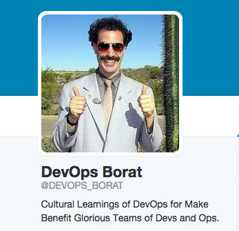
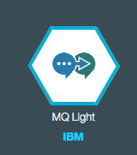
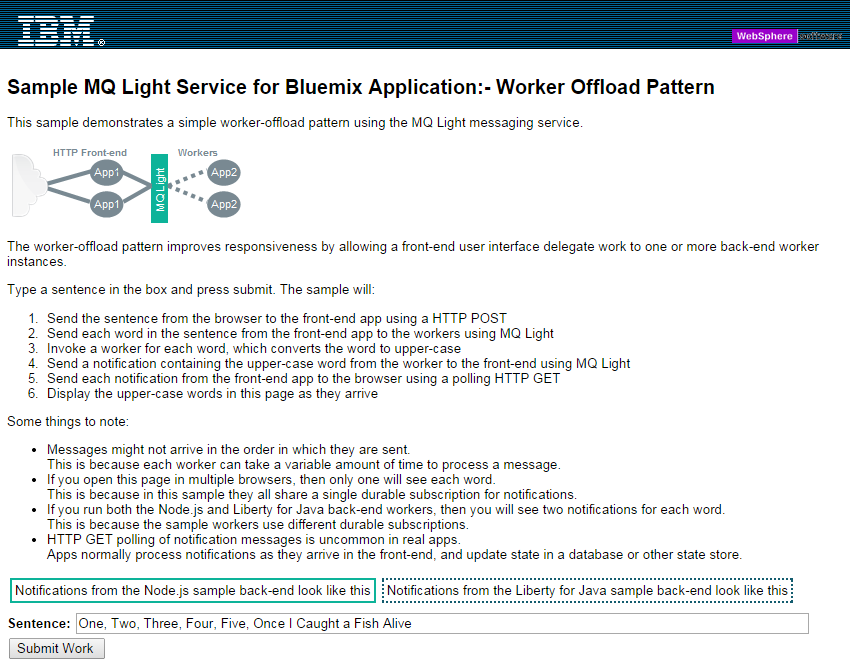

+++
categories = ["Sample Code", "Tutorial"]
date = "2015-01-19T09:34:18-05:00"
description = ""
draft = false
image = "two-pizza.jpg"
tags = ["amqp", "microservices", "bluemix", "mqtt", "node.js", "websockets"]
title = "Microservices in Bluemix"
aliases = [
    "2015/01/19/microservices-in-bluemix/"
]
slug = "microservices-in-bluemix/"
+++

Monolith apps are no more.  The age of the monolith is over.  It wasn’t that long ago that companies and developers (myself included) were deploying one giant app that did everything.  The app would serve all your static files, front-end HTML and CSS and Javascript, act as your REST API, serve as your data persistance tier, handles sessions, handle logins, and do security for your app.  The list could keep going on and on.  As the age of the code base progresses it gets more and more complicated and tangled and if a new feature needs to be developed or an old piece of code needs to be modified it takes a cross functional team of many different people to make it happen.

First we are going to talk about how a monolith app works, some of the positives and negatives and then we will talk about how things work in an app utilizing microserivces and the positivities and negatives associated with it.
<!-- more -->


## What is a Monolith?


In a traditional monolith app you would have your basic three tier app consisting of a persistence layer, middleware tier/business logic, and front end code.  The advantage of this is there is just one application to manage and scale.  However the downside is that any change to any of the three tiers it requires cranking up the giant distributed team and pushing a new release.  For example, if Dave a front-end dev wanted and he wanted to change the color of a button, it would require the whole app to built, tested, and re-deployed for a tiny change.

This is quite wasteful over everyone’s time, dev’s from the persistence layer, business logic team, and front end team need to be involved.  This involves cutting a new release, running it through whatever QA/test phases there is and pushing it to production and hoping that nothing else got introduced or anyone else regressed some features.

Additionally, by having a monolith app the code base can become quite large and incredibly complex to maintain.  This is compounded exponentially as the age of an app grows.  Eventually, there is so much tangled and twisted code its hard to understand how things link together and work.  This is one of the hidden costs of a monolith app.


## Microservice Advantages


A microservice can be defined simply as "fine grained SOA" – Adrian Cockcroft, Netflix.  In a longer description it can be thought of a set of small services with known functionality communicating over a common lightweight API, either HTTP REST API’s or more recently a lightweight messaging protocol (more on this later).


<blockquote>"Fine grained SOA" Adrian Cockcroft, Netflix</blockquote>


Microservices provide a huge advantage for the case we talked about earlier where Dave our front-end dev wants to change the color of a button, no longer does the giant dev machine need to be involved.  Instead the UI layer is a separate service and changes can be made independent from other parts of the application.  The UI team can crank out as many releases as their heart desires.


## 2 Pizza Teams


We aren’t talking about skimping on our employees and not feeding them enough at work, but we are instead talking about the size of the team.  Amazon first coined this term back in 2011.  It has been written about extensively and in such publications as the [Wall Street Journal](http://www.wsj.com/articles/SB10001424052970203914304576627102996831200).  Basically what it boils down to is having each team small enough that you can feed them with 2 pizza’s.  So you might be asking what the importance of this is, let’s use our example of our front-end dev Dave again.  By Dave having a small team they can organize themselves efficiently and deliver functionality on their own instead of being tied to a giant release of the application.  A team doesn’t have to multiple people, it can actually be a team of just 1 but be sure to never violate the 2 pizza team rule though.

[](two-pizza.jpg)


## I Wanna Go Fast (It’s All About Speed)


As popularized by Talladega Nights, speed is king.  Who doesn’t want to go fast?  If you answered no to that you are probably going to get beaten by your competition and be left in the dust.  As the [world is being flattened](http://www.thomaslfriedman.com/bookshelf/the-world-is-flat) there is constantly new competition every day and dev team’s have to constantly be delivering to keep their product and company relevant.

So back to our example of  Dave our front-end dev again. Since Dave’s team has their own UI service they can constantly deliver changes and new features without having to wait for other team’s to deliver functionality.  Dave’s team can even deliver new UI code that is gated on some business logic code by using [feature flags](https://codeascraft.com/2011/02/04/how-does-etsy-manage-development-and-operations/) and [A/B testing](http://apptimize.com/blog/2014/01/etsy-continuous-innovation-ab-testing/) to selectively enable code and test new code out.  This allows Dave’s team to try out new ideas and if they don’t work they fail fast and pivot and change course.  By doing this Dave’s product and company stay relevant.

Again as Ricky Bobby from Talladega Nights would say, "if you aint first you’re last."  When I saw the movie my mind obviously just went to car racing and sports but it can be extended to the IT industry as well.  If you aren’t first you probably aren’t relevant and someone else is beating you to market.  Eventually you could go out of business.


## DevOps DevOps DevOps


[](devops-borat.jpg)"To make error is human. To propagate error to all server in automatic way is [#**devops**](https://twitter.com/hashtag/devops?src=hash)." – [DevOps Borat](https://twitter.com/devops_borat).  This [quote](https://twitter.com/devops_borat/status/41587168870797312) sums up why DevOps is important.  With each service being completely different architecture wise and language it is in it would be near impossible for a central "ops" team to manage all the apps.  Instead in microservices world each team is responsible for their own app.  You might be thinking that having dev’s manage a production service is bad and they won’t be responsive.  You are wrong, multiple companies have been doing this for years and it actually creates a sense of empowerment in the dev team.  Dev’s don’t want a call at 3am in the morning notifying them that their service is down.  In turn dev’s start taking more pride in their work and start thinking about decisions they make that will affect the availability of their service.  It creates a new mindset for people.


## Let the Dev’s rule


Continuing on from above empowering dev’s is super important.  As a developer feels empowered they will make better decisions for their service they work on and thus end up making better decisions for the company.  When someone feels empowered they are putting their stamp of approval behind a product or feature and basically signing it with their name, code to them is a craft.

By embracing microservices and the de-centralized architecture it allows dev’s to innovate and come up with cool ideas and test them out.  If they don’t work that is ok, keep innovating and moving forward.  I am a photographer and in college someone once told me for every 10 pictures you take you will only get one good one.  The same can be said here as well, try, test, measure  (repeat). Obviously there is some science and planning put into this but the point is creating an environment to foster innovation.


## Design for Failure


When using microservices each service should be able to stand on its own and run by itself.  If it has outside dependencies it isn’t really a microservice.  Netflix is a prime example of this.  For example, if a service goes down that generates recommendations the whole site doesn’t break.  Other services keep functioning without the broken service.  In some cases, other services will know how to operate without the broken service.  Feature degradation or local caching can be used to prevent a break in the user experience.

This is designing for failure.  In the monolith world (which remember no longer exists) we would design and develop for the happy path and really never for the sad path.  By having a service based architecture we need to design and develop for the failure cases.  Some guy digging in his front yard could cut a piece of fiber and bring our monolith app to the ground.  By designing for a service not being there and allowing the product to continue to function is at utmost important.  In the monolith app dev’s sometimes would not think this way because everything is self contained by in a decentralized architecture you are forced to think about the failure case and how to handle it in a graceful way that doesn’t affect the user’s experience too much.


## Immutable Code


Part of this thought of designing for failure is having immutable code.  When introducing new code you MUST not affect the functionality of previous code.  In a product that has a UI this is a little harder to do but can be done with feature flags and A/B testing but with an API based service changing the inputs and outputs of a service is a big no-no.  If you absolutely must do this at least have a deprecation period of N+2 or 3 to give customers and consumers of your service some advanced warning that changes are coming.  Ideally you wouldn’t deprecate an API, just revision your API, for example if you are using HTTP REST API’s just use `/api/v1.0/` and for your next version `/api/v1.1/` as a prefix.


## Real world Microservices architecture


In the real world we would probably have a database, some business logic service (probably multiple of these), a UI service, our basic three tier app but this time disjoint from each other.  See below.
The "glue" between the services is supposed to be something light-weight, you can use HTTP REST API’s but more recently there has been a move to a messaging based "glue".  In particular like MQTT or AMQP.  This is great as it allows a service to be a "worker" or a client of another service, or in queuing terms, producers and consumers.


## How to use Bluemix to create Microservices


To demonstrate this real world example let’s talk about how this would work in Bluemix.  In Bluemix we can create a bunch of services, in case they will be in Node.js and the "glue" between our services will be MQLight.  An important point we should talk about here is the notion of producer/consumer (pub/sub) vs round-robin queuing.

For our example let’s say we have a service that is scaled out to 5 nodes (we must be really popular).  Each of these nodes is a worker for some business process, in this case let’s say sending a registration email.  When someone sign’s up for our site we want to send them a registration email, we don’t want each of the 5 nodes of our service emailing the person.  I would probably walk away from something if I got 5 duplicate registration emails.  In this case we want round-robin queuing.

However on the converse side there is cases where we want producer/consumer (pub/sub queuing).  This effectively means all 5 nodes of a service will receive the same message and respond.  Let’s say we have a UI service that is the front-end for a real time chat service.  If our application is scaled out to 5 nodes how can we properly propagate chat messages to all the connected clients.  The answer is allowing each front-end service to receive the same message to relay to all the clients.

[](mqlight.jpg)When architecting your microservices you need to keep queuing in mind and how clients and services communicate with each other.  Make sure you choose a queuing technology that supports your desired behavior of pub/sub or round-robin.

So where does this leave us in Bluemix?  MQLight, with MQLight you can easily do pub/sub and round-robin with the same service provider.  This is great because as the developer I don’t have to use two different messaging providers.


## Example App in Bluemix


So let’s build something to demonstrate all of this.  The example app we will be building contains a front-end service that allows users to enter text and another service that will convert it to upper case.  While this is not a real world example it demonstrates microservices using backend workers.

A real world example might be  an image processing app that applies a sexy filter to an image it and then uploads it to Instagram.  If we did this we could break this up into three services.  A web service that accepts an image over http(s), our sexy filter engine (maybe imagemagick), then a service that uploads the image to our social media network of choice.

So back to our example app of converting text to uppercase.  The UI is below, our UI doesn’t lock when we submit data and we can keep using it.  As results are finished processing in our "text uppercase" service, results are delivered real time to our front-end service.

[](sample_screenshot.png)

To make this seem more world the example code introduces some timeouts/waits to make it seem like some backend processing is going on in a microservice.  To get this running follow the following steps.

```
    git clone https://hub.jazz.net/git/ibmmq/mqlight-worker-offload-sample-node
    cf create-service MQLight standard MQLight-sampleservice
    cf push
```


What the above does is checkout some example code that contains a front-end service and a back-end service that does our "text uppercasing" and creates a QLight to provide the messaging between our two services.

Once the cf push command is done running (it might take a bit) we should see something like the following saying our apps are up.

Text processing service:

```
Showing health and status for app MQL.sample.node.backend in org jbsloyer@us.ibm.com / space demos as jbsloyer@us.ibm.com...
OK
requested state: started
instances: 2/2
usage: 256M x 2 instances
urls:
last uploaded: Mon Jan 19 18:52:05 +0000 2015
     state     since                    cpu    memory          disk
#0   running   2015-01-19 01:53:08 PM   0.0%   11.8M of 256M   75.8M of 1G
#1   running   2015-01-19 01:53:05 PM   0.0%   11.5M of 256M   75.8M of 1G
Front-end service:
Showing health and status for app MQL.sample.node.frontend in org jbsloyer@us.ibm.com / space demos as jbsloyer@us.ibm.com...
OK
requested state: started
instances: 1/1
usage: 512M x 1 instances
urls: mqlightsample-node-undeputed-trierarch.mybluemix.net
last uploaded: Mon Jan 19 18:53:16 +0000 2015
     state     since                    cpu    memory          disk
#0   running   2015-01-19 01:54:20 PM   0.0%   24.3M of 512M   78.7M of 1G
```

So let’s checkout the app, I have recorded a short video of it working.  If you notice the text service is simulating things like a real world service might respond with results coming back as they finish being processed.


## Stay Tuned!!!


There will be some real world examples coming on how to use microservices in Bluemix since now we have a foundation on what microserivces are.  Please stay tuned and follow me on Twitter at [@jsloyer](http://twitter.com/jsloyer) for some real world apps!


## Webcast playback


The replay of the webcast is available at [here](http://ibm.biz/BlmxMicroservices-Blog).
