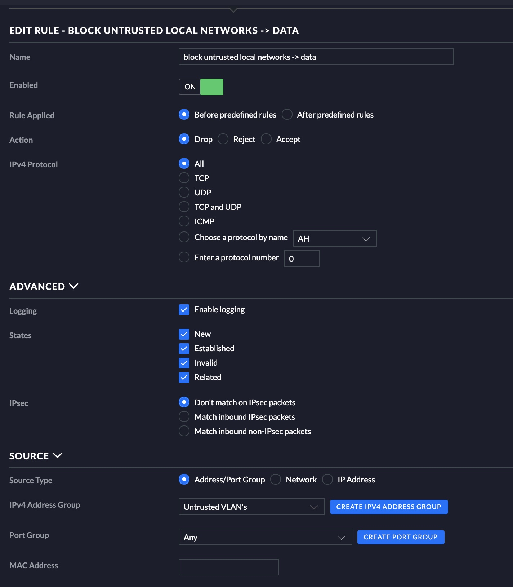
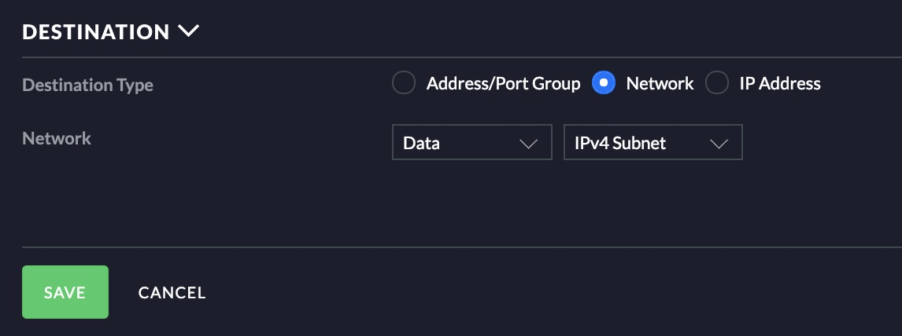
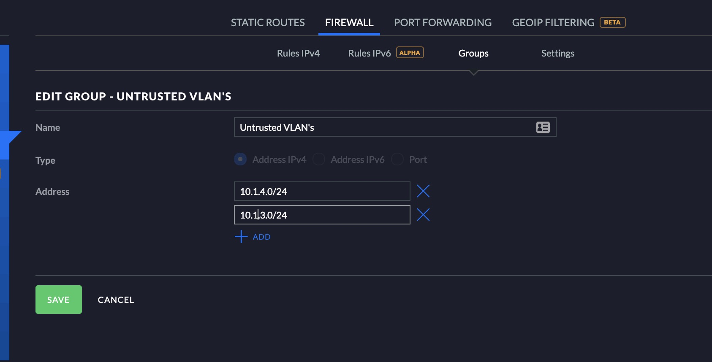
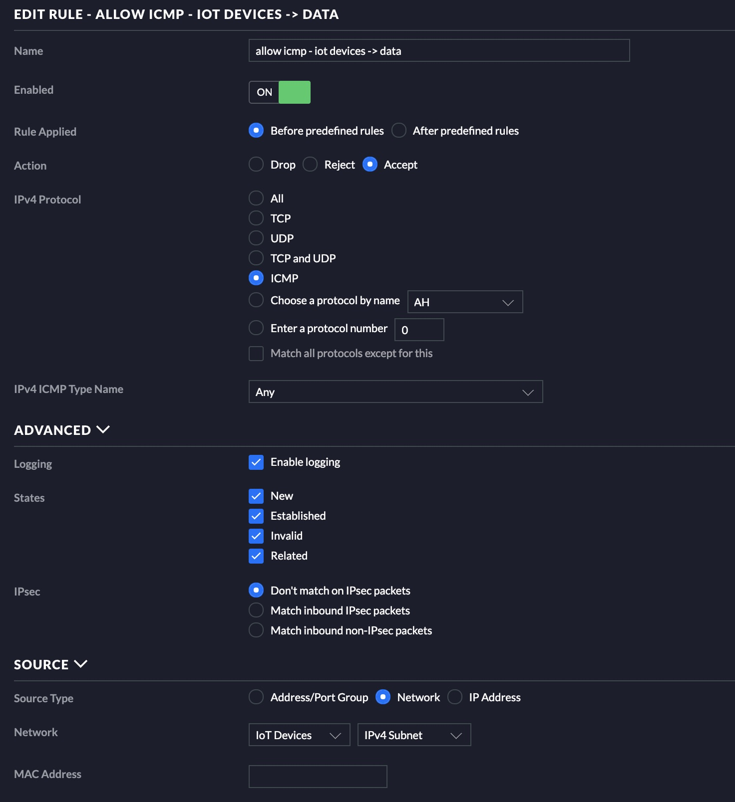
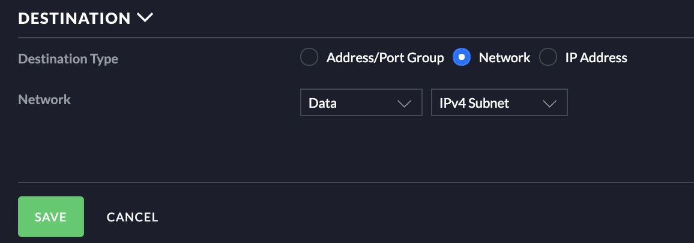
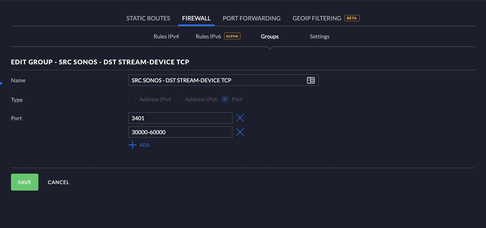
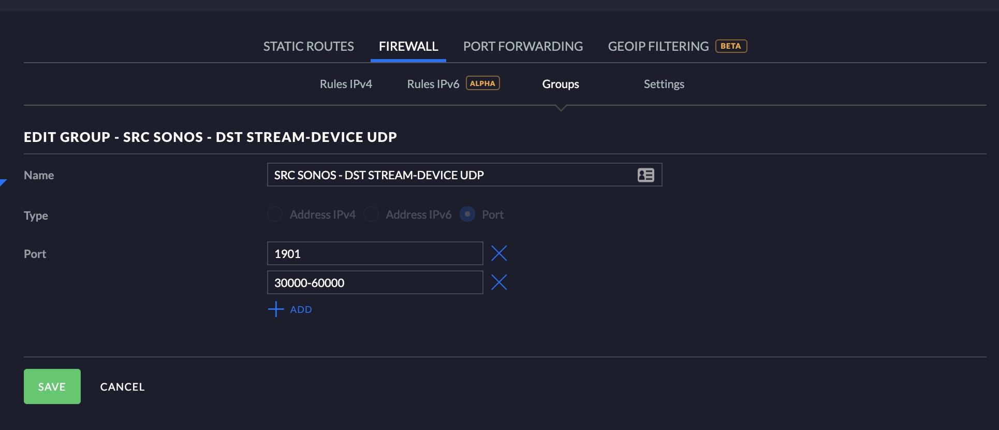
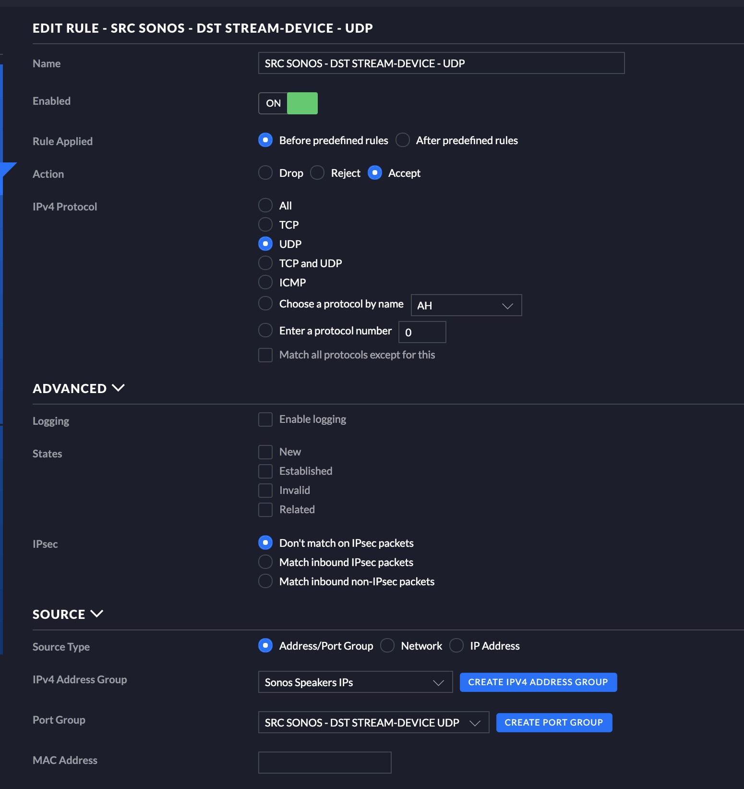
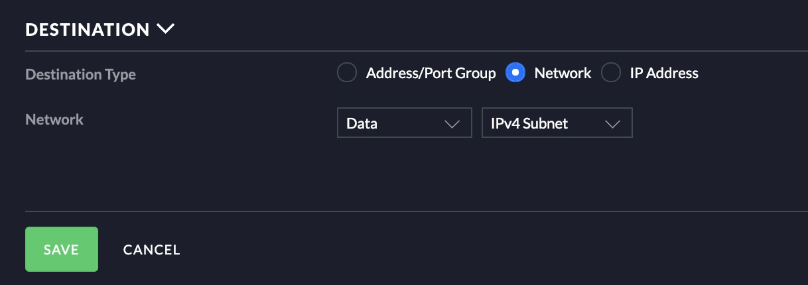
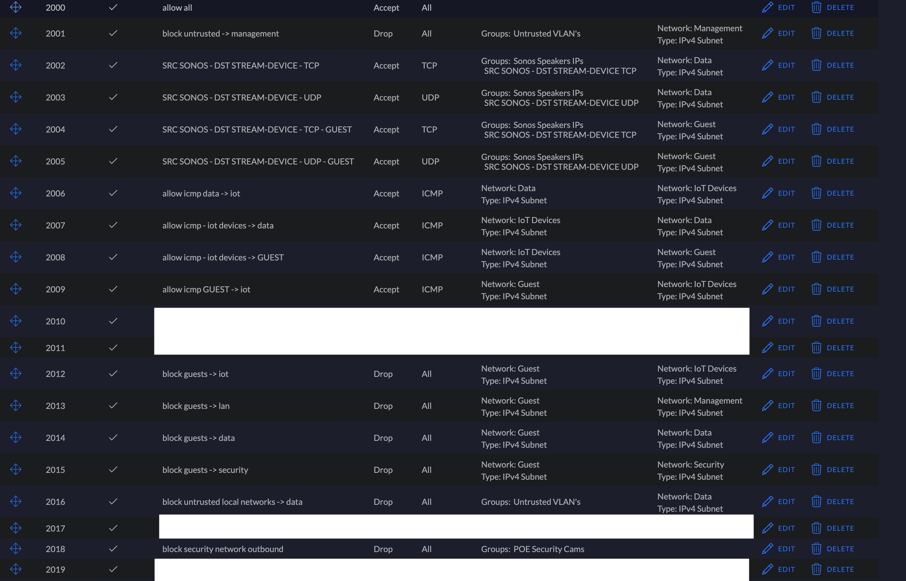

+++
categories = ["Tutorial"]
date = "2019-02-11T13:24:00-05:00"
description = "Setup a multi-vlan network with sonos and the Unifi USG with Sonos Speakers"
draft = false
image = "wall.jpg"
tags = ["sonos", "usg", "firewall", "unifi", "ubiquiti"]
title = "Firewall Ports for the Unifi USG and Sonos Speakers"
slug = "sonos-usg-firewall-ports/"
+++

# Background
At home I run the 4 port USG router on my Unifi'ed network.  I have a couple different VLAN's, Data, Management, Security, IoT, and Guest.
Each of these networks already has some policies that prevent some of the VLAN's talking to each other.  For example I have some firewall rules that prevent my security cameras from talking to the IoT network and talking out to the public Internet.  For the past couple months I haven't been running a locked down IoT network.  What this means for me is not allowing the IoT VLAN to talk to my Data and Management VLAN's.  This is a problem as all of my servers, my iPhone, and laptop are on the Data VLAN.  When I turned on a firewall rule to block all traffic to the Data VLAN from the IoT VLAN my Sonos speakers stopped working.  After lots of research and trial and error I got things working again.  To get things working again you need to run a ICMP Proxy on your USG as well as turn on some additional firewall rules.

# ICMP Proxy
The ICMP Proxy is probably the most important bit of all of this.  The proxy will forward ICMP packets from one VLAN to another.  This is crucial in getting Sonos to work on a multi-VLAN setup.  For me the following configuration worked, I will walk through what needs to be changed for your setup.

**Notes**
- VLAN 2 is my Data VLAN (trusted)
- VLAN 4 is my IoT VLAN (untrusted)
- The config below is for a USG 4 Port.  If you are running a 3 Port USG change `eth0` to `eth1`.
- You will need to change the VLAN numbers twice below, for example `eth0.2` and `eth0.4`.
```
{
    "protocols": {
        "igmp-proxy": {
            "interface": {
                "eth0.2": {
                    "alt-subnet": [
                        "0.0.0.0/0"
                    ],
                    "role": "upstream",
                    "threshold": "1"
                },
                "eth0.4": {
                    "alt-subnet": [
                        "0.0.0.0/0"
                    ],
                    "role": "downstream",
                    "threshold": "1"
                }
            }
        }
    }
}
```

The above snippet will need to go on your Unifi Controller.  If you are on Linux it is located at `/var/lib/unifi/sites<siteid>/config.gateway.json`.  To get your site id open your web browser and log into your Unifi controller.  The site id will be in the url.  Make sure you are targheted to the correct site.  For example a possible url could be `https://10.1.1.1:8443/manage/site/fozvabde/devices/1/50`.  In this case the site id is `fozvabde`.

Once you have placed your eddited JSON snippet into `/var/lib/unifi/sites<siteid>/config.gateway.json` login into your controller and navigate to the Devices tab.  On that tab select the USG and then click on Config and then Manage Device.  Here you will want to click on force provision.  Doing this will write the above `config.gateway.json` file to your USG and then turn on the ICMP Proxy.  At this point check to make sure having a Sonos controller on your trusted VLAN can talk to your Sonos Speakers on your untrusted VLAN.  If it doesn't work check the `config.gateway.json` file and make sure you have your interfaces and VLAN's correct.  If you can't figure it out leave a comment below.

# Firewall Rules
Since we now have things working again we need to break things again.  We need to block the traffic from the untrusted VLAN to the trusted VLAN.

## Block all untrusted traffic

[](usg-sonos-1.jpg)

[](usg-sonos-2.jpg)

I have a group created for my untrusted VLAN's, see below.

[](usg-sonos-3.jpg)


## Allow ICMP Traffic
Next we need to allow ICMP traffic from your untrusted VLAN to your trusted VLAN.  See below.
[](usg-sonos-4.jpg)

[](usg-sonos-5.jpg)

## Allow Sonos Traffic
Next wee need to allow Sonos traffic.  To do this I created two port groups, one for UDP and one for TCP.  each of them has a corresponding firewall rule.

### Allow Sonos TCP
I created a port group for my TCP traffic.  See below.
```
SRC SONOS - DST STREAM-DEVICE - TCP
TCP-3401
TCP30000-60000
```

[](usg-sonos-6.jpg)

In the rule below you will notice there is a destination group as well in addition to the ports.  I have added the IP's of my Sonos speakers to a group so I can only open a couple pinholes for traffic instead of the whole VLAN.  See below.

[](usg-sonos-8.png)

[](usg-sonos-9.jpg)

[](usg-sonos-10.jpg)


### Allow Sonos UDP
I created a port group for my TCP traffic.  See below.
```
SRC SONOS - DST STREAM-DEVICE - UDP
UDP-1901
UDP30000-60000
```

[](usg-sonos-17medium.jpg)

I am using the same port group for the source as I did above for the IP's of the Sonos speakers.

[](usg-sonos-11.jpg)

[](usg-sonos-12.jpg)


## Ordering of the rules
The ordering of the firewall rules is extremely important.  Make sure you have your allow rules before your deny rules.  If not things will not work.

See below for my final set of rules.

[](usg-sonos-13.jpg)

# Credit
https://en.community.sonos.com/troubleshooting-228999/multiple-subnets-vlans-and-sonos-workable-clavister-solution-30950


