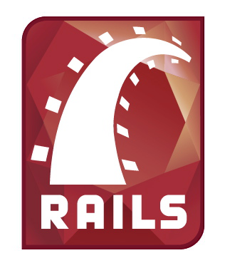

+++
categories = ["Sample Code"]
date = "2015-03-05T10:09:31-05:00"
description = ""
draft = false
image = "/migrate.jpg"
tags = ["bluemix", "postgresql", "redis", "ror", "ruby", "ruby on rails"]
title = "Tips for Migrating Ruby on Rails Applications to Bluemix"
aliases = [
    "2015/03/05/tips-for-migrating-ruby-on-rails-applications-to-bluemix/"
]
slug = "tips-for-migrating-ruby-on-rails-applications-to-bluemix/"
+++

Who doesn’t love some Ruby?  Bluemix definitely loves Ruby on Rails!  Sometimes running a Ruby on Rails app can be a little tricky, so I have included some tips and tricks for migrating your Ruby on Rails app to Bluemix. They will include:

  * Required gems
  * Code tweaks
  * Accessing external databases
  * Deploying your app


<!-- more -->


### Required gems


If you are using PostgreSQL you need to include `pg`. Sqlite3 is included to get local development working as well.  Add the following line to your Gemfile.

```
gem 'pg'
gem 'sqlite3'
```

Additionally there are two more gems you should include as well.  These gems will be included by some Ruby buildpacks but we should include them just in case.

```
gem "cf-autoconfig", "~> 0.2.1"
gem 'rails_12factor', group: :production
```


### Code tweaks & external databases


When you deploy your app to Bluemix, the Ruby buildpack will overwrite your database.yml file to pull in the attached DB service.  You should have a `database.yml` file if you are running locally.  Below is a pretty standard one:

```
# SQLite version 3.x
#   gem install sqlite3-ruby (not necessary on OS X Leopard)
development:
  adapter: sqlite3
  database: db/development.sqlite3
  pool: 5
  timeout: 5000

# Warning: The database defined as "test" will be erased and
# re-generated from your development database when you run "rake".
# Do not set this db to the same as development or production.
test:
  adapter: sqlite3
  database: db/test.sqlite3
  pool: 5
  timeout: 5000

production:
  adapter: sqlite3
  database: db/production.sqlite3
  pool: 5
  timeout: 5000
```


If you are using Redis and PostgreSQL, it can be a little tricky to use two databases.  Here is the config for using Redis with [Resque](https://github.com/resque/resque) (a task scheduler that is backed by Redis).  This file is specific to resque and its located at `config/initializers/resque.yml`.

```
require 'resque/status_server'
require 'json'

rails_root = ENV['RAILS_ROOT'] || File.dirname(__FILE__) + '/../..'
rails_env = ENV['RAILS_ENV'] || 'development'

resque_config = YAML.load_file(rails_root + '/config/resque.yml')

if rails_env != "production"
    Resque.redis = resque_config[rails_env]
else
    vcap_services = JSON.parse(ENV['VCAP_SERVICES'])
    credentials = vcap_services["rediscloud"][0]["credentials"]
    Resque.redis = ":" + credentials["password"] + "@" + credentials["hostname"] + ":" + credentials["port"]
end
```

### Deploy your app!


To deploy your app, you need to create some services in Bluemix for your app.  We will do this with the Cloud Foundry command line.

_PostgreSQL:_

```
cf create-service elephantsql turtle postgres-myapp
#postgres-myapp is the name of your service, you can name this whatever you want
```

_Redis:_

```
cf create-service rediscloud 25mb redis-myapp
#redis-myapp is the name of your service, you can name this whatever you want
```


### Prepare your app


Cloud Foundry requires a file called `manifest.yml` to help bind services to your app and defining memory limits, CPU limits, and the number of instances required.  Belows is an example file I used.  The name of the app is the unique identifier of your app that will be in your account.  Hostname is the hostname of the app, it will be _yourhostname_.mybluemix.net or if you are running in London it will be _yourhostname_.eu-gb.mybluemix.net.  The `command` is pretty important, it says it will run the `db:setup` everytime the app is deployed, this should probably be changed to `db:migrate` instead though.

```
---
applications:
#swap out myapp-jbs for your own app name
- name: myapp-jbs
  memory: 1GB
  instances: 1
  path: .
  command: bundle exec rake db:setup && bundle exec rails s -p $PORT
  services:
  #swap out the below for your own
  #cf cs elephantsql turtle yourownname
  #cf cs rediscloud 25mb yourownname
  #redis cloud has different plans, check out cf marketplace for the plans
    - postgres-myapp
    - redis-myapp
```

### Push your app


So we are on the final step, time to push our app!  If you are using Ruby 2.2.0, it’s not officially supported by Cloud Foundry, but there is a buildpack that is part of the Cloud Foundry community github that we can use.  It tracks pretty close to the latest Ruby and Rails.  For my app I used Ruby 2.2.0 and Rails 4.2.0:


```
cf push -b https://github.com/cloudfoundry/ruby-buildpack.git

```

### One last little tip…

One last little tweak if you are familiar with Git it will make your life in Cloud Foundry land a little better.  There is a file called `.cfignore` that goes in the root of your project, it basically acts like `.gitgnore` and prevents files being updated to Cloud Foundry.  So for Ruby on Rails you probably would want your vendor folder here and etc.  I have put one below that I use.

```
.DS_STORE
# Ignore bundler config
/.bundle

# Ignore the default SQLite database.
/db/*.sqlite3

# Ignore all logfiles and tempfiles.
/log/*.log
/tmp

# Ignore coverage
/coverage

# Tag file
tags
.idea/

.swo
.swp

.envrc

cscope*

doc/*

.jira-url

vendor/*
```

If you have any issues please reach out to us on [StackOverflow](http://stackoverflow.com/questions/tagged/bluemix)!  In the top righthand corner click “Ask Question”.
