+++
categories = ["Tutorial"]
date = "2015-07-20T10:54:13-05:00"
description = ""
draft = false
image = "unplug.jpg"
tags = ["bluemix", "devops"]
title = "Zero downtime deployments with Bluemix and Codeship"
aliases = [
    "2015/07/20/zero-downtime-deployments-with-bluemix-and-codeship/"
]
slug = "zero-downtime-deployments-with-bluemix-and-codeship/"
+++

This is a part two post following up on my earlier post on [Zero Downtime Deployment with the CF Autopilot Plugin](/post/zero-down-time-deploys-with-the-cf-autopilot-plugin/).  I highly encourage you to read the first part before reading this post but if you are lazy I will go over the high level concepts here.

## Overview of Part 1 (Quick Refresher)

In [part 1](/post/zero-down-time-deploys-with-the-cf-autopilot-plugin/) we went over what a zero downtime deployment is and why it is in important. Let's briefly cover that again.

Zero Down time deployments are basically what they sound like.  You update production without taking downtime.  It’s not always that simple though.  For the context of this post we are going to be talking about how to do zero down time deployments in Cloud Foundry.<!-- more -->

Basically it’s a little trick to taking advantage of the way Cloud Foundry runs underneath the covers.  Before we jump into it, there are a couple of caveats that we should discuss first.  To successfully take advantage of zero down time deployments you should have followed the [12 Factor App guidelines](http://12factor.net/). This will ensure that your app is horizontally scalable and can be deployed in a manner that will result in zero down time.  Below are some highlights that you should abide by.

1. Do not store sessions on disk or in memory.  Store them in some type of shared database or file system.  This could be your favorite database or an in memory database as well.

2. Do not store configuration information in your application or on disk.  You should store your config info for your app in environment variables.

3. This is probably the most important, your application needs to be forward and backwards compatible with your database schema…  Say what?  Yes, you need to trust your developers to manage the database schema from your code.If you are using a relational database, you will need some kind of framework to do database migrations for you.  It’s not just that simple with relational databases though…  If you have a big database migration DO NOT PERORM MIGRATIONS THAT WILL INTERRUPT TRAFFIC!  Perform them slowly over time where migrations do not impact users and traffic.  Yahoo had a major application upgrade and it took them 6 months to do the migration to avoid impacting users and taking an outage.  Remember we do not take outages…  If you are in NoSQL land, your life is easier.  Just revision your API’s and educate your developers on forward and backwards data compatibility.

## Importance of Zero Down Time Deployments

So why are zero down time deployments so important? The answer is simple, to keep your website/app up so you can make money! Well that might be over-simplified a bit, but basically it all boils down to keeping your app up so you can continue to do what you do best, and hopefully that involves making money. If you look at Facebook, for example, they put code into production weeks and months before a feature is exposed to the public. They extensively test the features on employees first, then slowly enable the features to the rest of the world. This is key, getting features in front of your customers and getting feedback from them. If it works that’s great, but if it doesn’t at least you know in a short time frame so you can remove it and pivot to go in a different direction. The current landscape is so fast paced that if you don’t get a feature out, your competition could beat you.

## How does it work?

So let’s walk through what needs to happen to perform zero downtime deployments in Cloud Foundry.  For the use of the walk-through, the application is currently taking traffic on `myapp.mybluemix.net`.

  1. Deploy your app or use a currently running app.
Currently your application is taking traffic on `myapp.mybluemix.net`.
[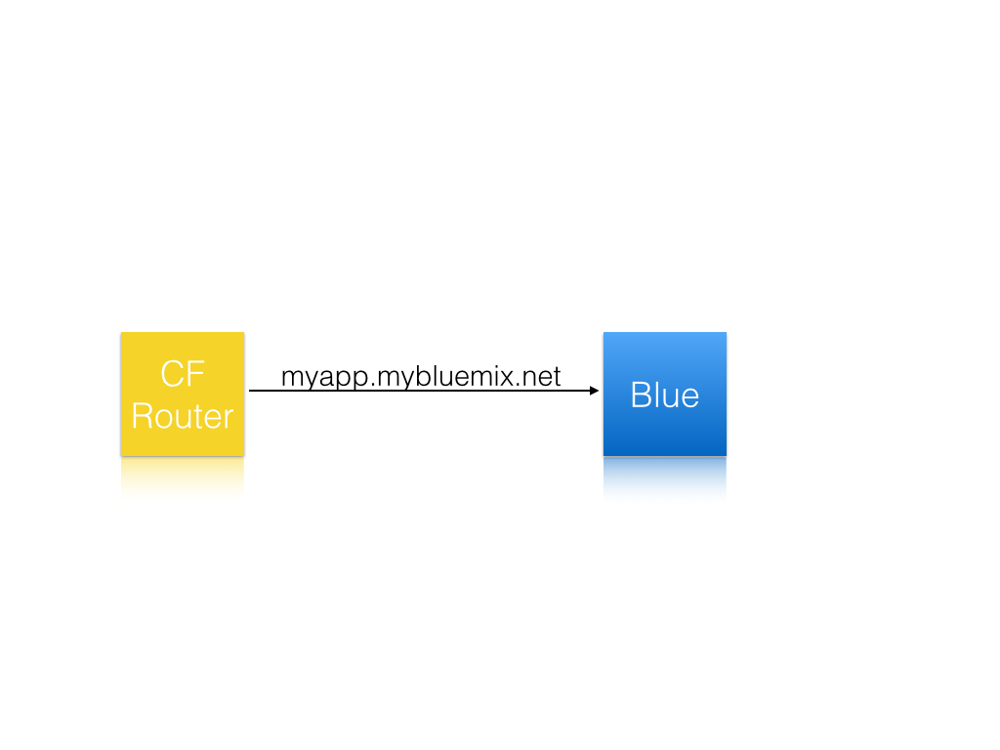](zero-downtime-graphics.001.png)

  2. Deploy the new version of your app to `myapp-temp.mybluemix.net`.
At this time there is currently two versions of your app running.  `myapp.mybluemix.net` is still taking production traffic.
The new app `myapp-temp.mybluemix.net` is separate, it can be pointed to your production API keys and databases at this point.
[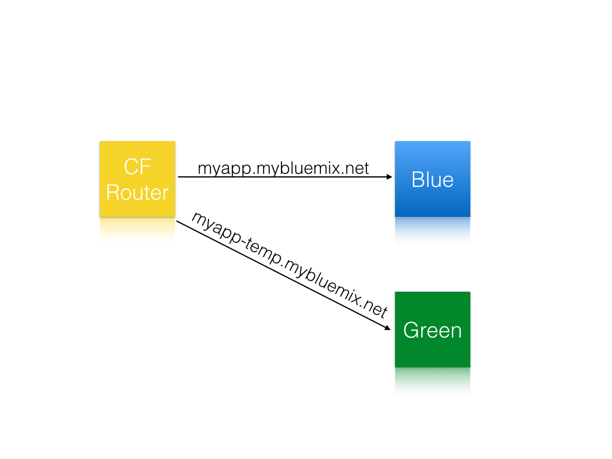](zero-downtime-graphics.002.png)

  3. Perform smoke tests on the new version of the application.
Some people say this step is optional, but to me its not.  This is key to make sure there wasn’t any weird regressions or merge issues, they CAN happen…

  4. Map production traffic to the new version of your app.
At this point the old version of your app and the new version are both taking production traffic.
[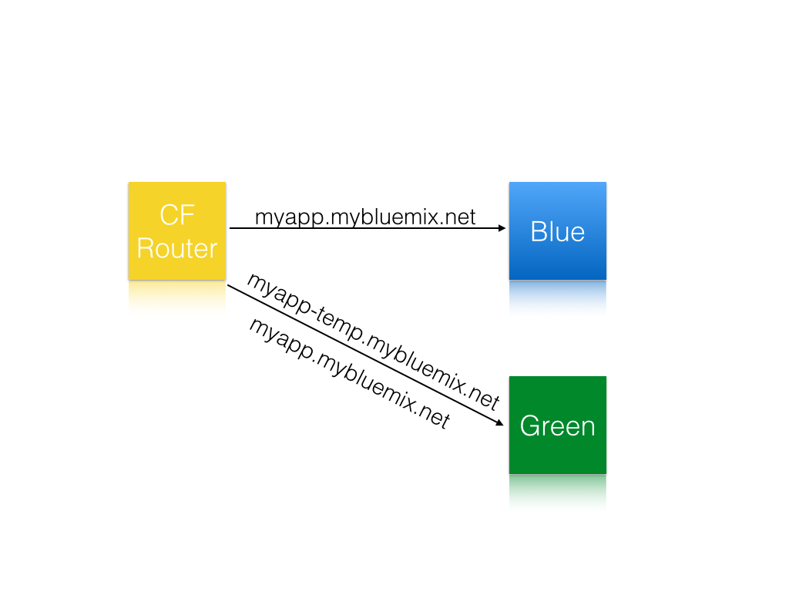](zero-downtime-graphics.003.png)

  5. Unmap production traffic from the old version of the app.  You can optionally delete the old version as well.
At this point the new version becomes production and ONLY it is taking traffic.
The new version still has two URL’s though, `myapp.mybluemix.net` and `myapp-temp.mybluemix.net`.
[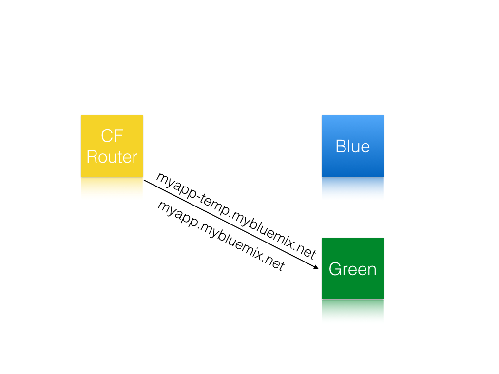](zero-downtime-graphics.004.png)

  6. Remove the temporary route `myapp-temp.mybluemix.net` from the new version of your app.
[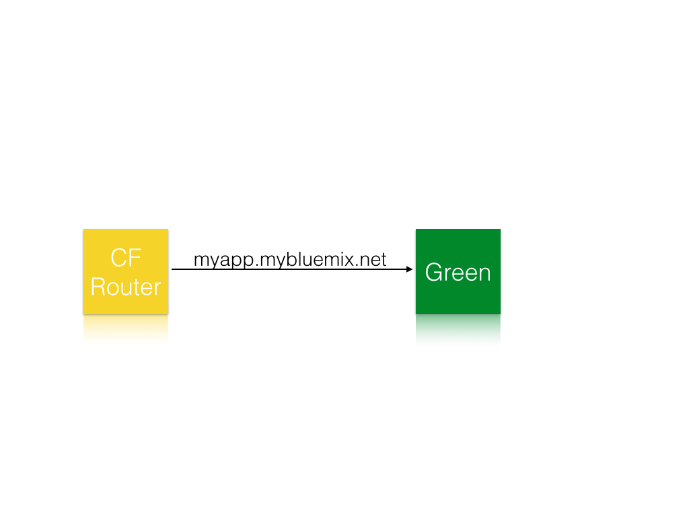](zero-downtime-graphics.005.png)

While this can be scripted there really isn’t a need to do that, there is a Cloud Foundry CLI plugin to do this.

## Autopilot plugin

Recently the Cloud Foundry CLI started supporting plugins.  This is the holy grail for CF and you can start doing some fun stuff.  In this case, the fun stuff is automating the complex, possibly human error-prone, steps above.  As a dev, if I can automate something and reduce the chance of something going wrong, I am all in.  If you do this, your IT/operations department will love you.

[The plugin](https://github.com/concourse/autopilot) performs the above steps for you for performing the zero downtime deployment.

In [part 1](http://jeffsloyer.io/2015/06/19/zero-down-time-deploys-with-the-cf-autopilot-plugin/) we deployed our application manually to Bluemix using the autopilot plugin locally, in this tutorial we are going to use [Codeship to automate our continuous delivery pipeline](http://codeship.com/?utm_campaign=jeffsloyer.io) to use the plugin to perform the zero downtime deployments.

## Codeship setup

First make sure you have a [Bluemix](http://bluemix.net/?cm_mmc=Display-JeffSloyer.io-_-BluemixSampleApp-CodeShipAutoPilotPlugin-_-Node-WatsonPersonalityInsights-_-BM-DevAd) account, if you do not sign up by clicking [Bluemix](http://bluemix.net/?cm_mmc=Display-JeffSloyer.io-_-BluemixSampleApp-CodeShipAutoPilotPlugin-_-Node-WatsonPersonalityInsights-_-BM-DevAd).

Secondly make sure you have signed up for a Codeship account, to do this head [here](https://codeship.com/registrations/new?utm_campaign=jeffsloyer.io).  When I signed up, I clicked "Sign up with github", make sure you do this so Codeship can authenticate with your Github account.

Once you are signed in click "Setup new Project", it will bring you a screen like below.

[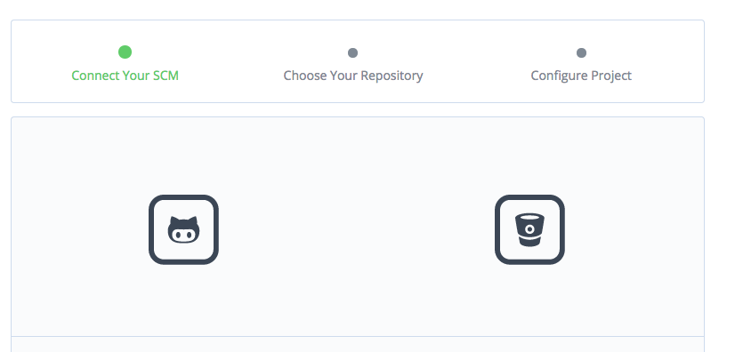](connectscm.png)

Click on the button on the left.   If you signed up with your Github account it will authenticate you with Github, if you haven't you will need to connect your account to Github.

Once you have done this you will get a screen like below.  Codeship will show you all the projects you have access to.

[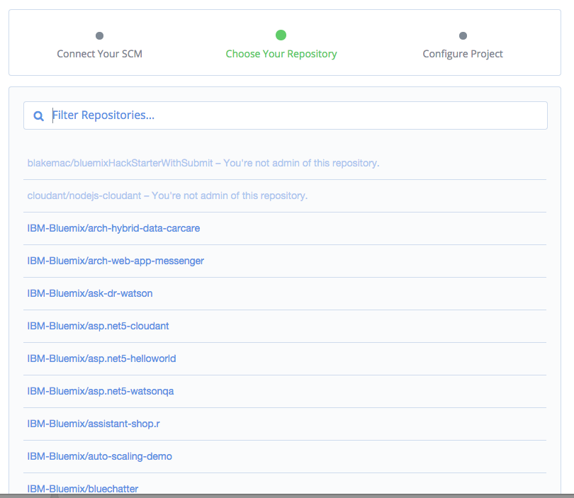](choose-repo.png)

Click on the repo you would like to use.

You will be then brought to a screen that ask you to setup your pipeline.

First, we need to remove the test pipeline, lets click on "Delete". If you had unit tests you could run them here, for example `grunt`.

[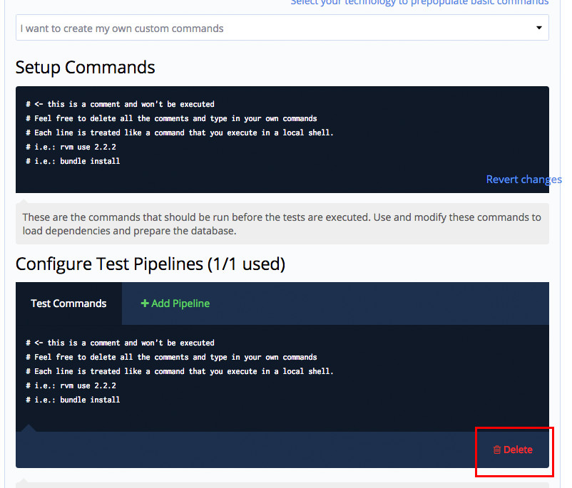](deletepipeline.jpg)

Next since this example is a Node.Js project, we want to make sure the node modules are correct, we want to run `npm install` here.  We need to clear out the initial starter setup commands that have been highlighed below.

[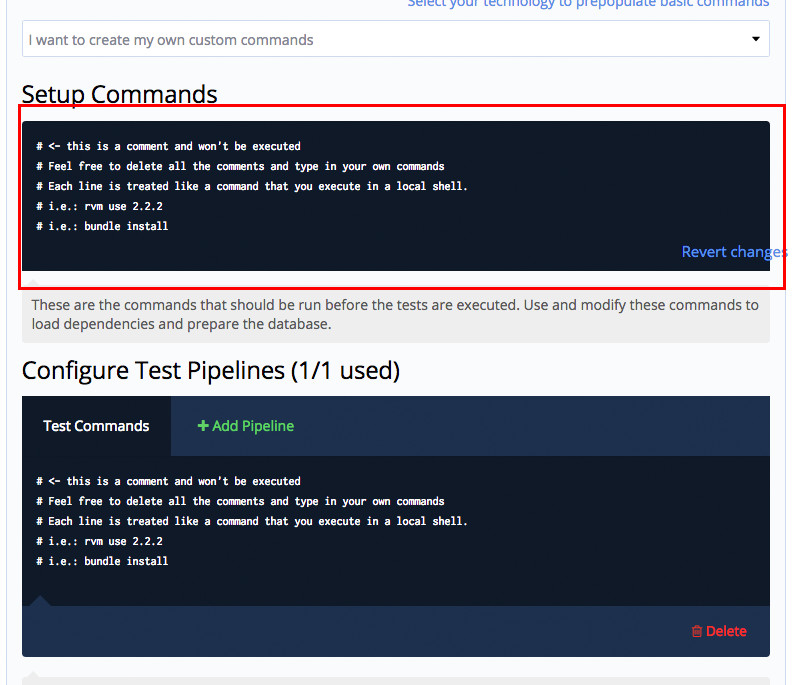](clearsetup.jpg)

It should look like the following now.

[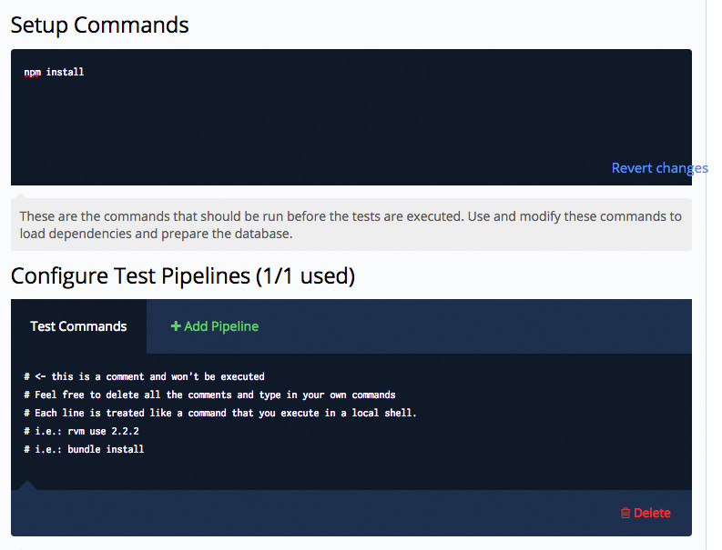](npminstall.jpg)

Note, if you are using a different language you would want to run the appropriate dependency installer here, for example for Java `mvn install`.

Lastly, click "Save and goto dashboard".

Click on "Project settings" in the top right, then click on "Environment variables".  You will be brought to a screen like the following.

[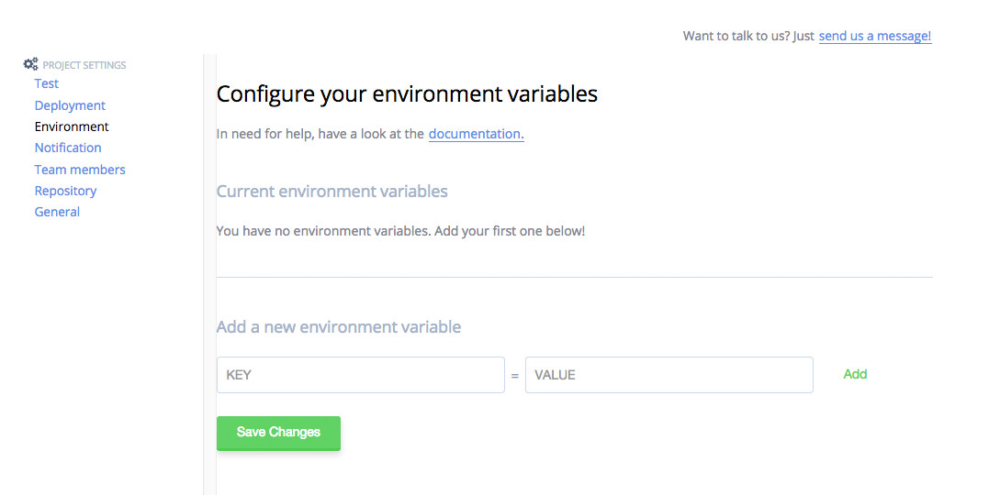](envars.jpg)

You need to setup a couple environment variables to make this work.

  * CF_API
  * CF_SPACE
  * CF_ORG
  * CF_USERNAME
  * CF_PASSWORD

Below is a screen shot of things setup.

[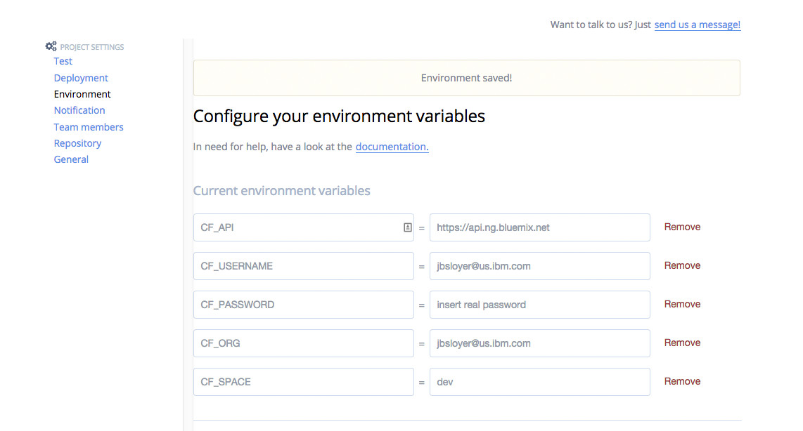](envarssetup.jpg)

Next, click deployment on the left and type in "master" without the quotes for the branch name and click "Save pipeline settings".

[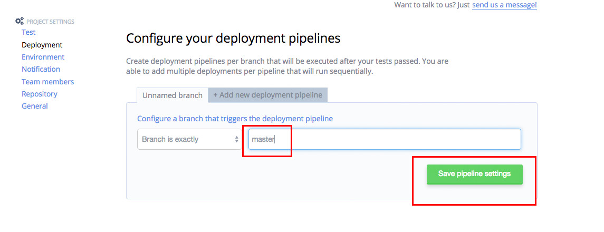](masterbranch.jpg)

Click "Custom Script".

[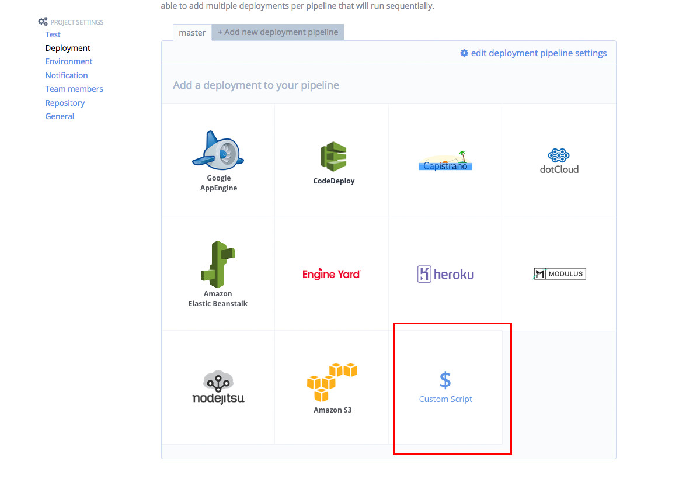](customscript.jpg)

Paste in the following code, replace `myapp` with the name of your app.
Note: This requires your app to have a `manifest.yml`

It should look like the following.

[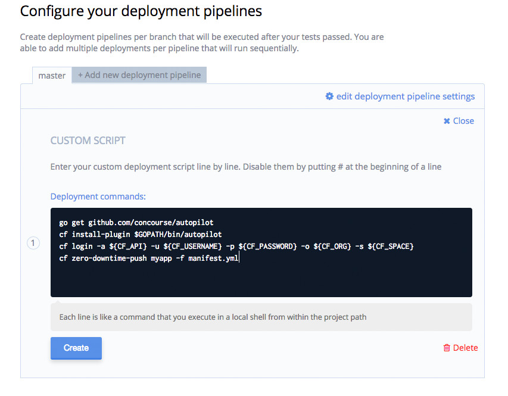](codesnip.jpg)

Click "Create".

You are all set.  Next time you do a git push to Github your app will be auto deployed to Bluemix!

I would love to hear your feedback and any suggestions you have, please reach out to me on Twitter [@jsloyer](https://twitter.com/jsloyer target=)
